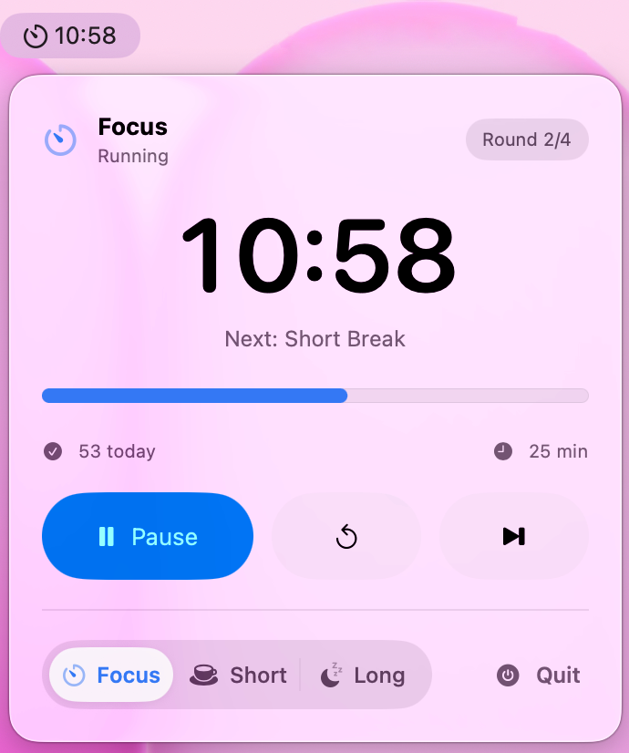

# PomodoroBar

PomodoroBar 是一个轻量的 macOS 菜单栏番茄钟，用 SwiftUI 构建。它不会出现在 Dock 里，可以直接在菜单栏显示倒计时，并在专注或休息结束时发送系统通知。

PomodoroBar is a lightweight macOS menu bar Pomodoro timer built with SwiftUI. It stays out of the Dock, shows the current countdown in the menu bar, and sends a notification when a focus or break session ends.



## Features

- 菜单栏倒计时，显示当前阶段图标和进度百分比
- 支持专注、短休息、长休息三个阶段
- 每轮结束后自动切换到下一个阶段
- 每完成 4 轮专注后进入长休息
- 支持开始/暂停、重置、跳过和退出
- 自动保存当天完成的专注次数
- 系统通知和提示音
- 支持中文和英文界面
- 提供本地 DMG 打包脚本

## English

- Menu bar countdown with phase icon and progress percentage
- Focus, short break, and long break phases
- Automatic phase switching after each session
- Long break after every 4 focus rounds
- Pause, reset, skip, and quit controls
- Daily completed-focus count saved locally
- System notifications and sounds
- English and Simplified Chinese localization
- DMG packaging scripts for local releases

## 系统要求 / Requirements

- Xcode with Swift 6 support
- Main target: macOS 26.0 or later
- Legacy target: macOS 13.0 or later

## 构建 / Build

使用 Xcode 打开 `PomodoroBar.xcodeproj`，然后运行 `PomodoroBar` scheme。

Open `PomodoroBar.xcodeproj` in Xcode and run the `PomodoroBar` scheme.

也可以使用命令行构建：

```bash
xcodebuild -project PomodoroBar.xcodeproj -scheme PomodoroBar -configuration Release build
```

Legacy 版本：

```bash
xcodebuild -project PomodoroBar.xcodeproj -scheme PomodoroBarLegacy -configuration Release build
```

## 本地运行 / Local Run

```bash
./script/build_and_run.sh
```

## 打包 / Package

生成本地 DMG：

```bash
./script/package_dmg.sh
```

## 注意 / Notes

PomodoroBar 目前使用本地/开发者签名。如果公开分发未公证版本，用户可能需要在 macOS 的“隐私与安全性”里手动允许打开。

PomodoroBar is distributed as a local/developer-signed macOS app. If you distribute a build publicly, users may need to allow it in macOS Privacy & Security unless you notarize the app with an Apple Developer account.

## License

MIT
