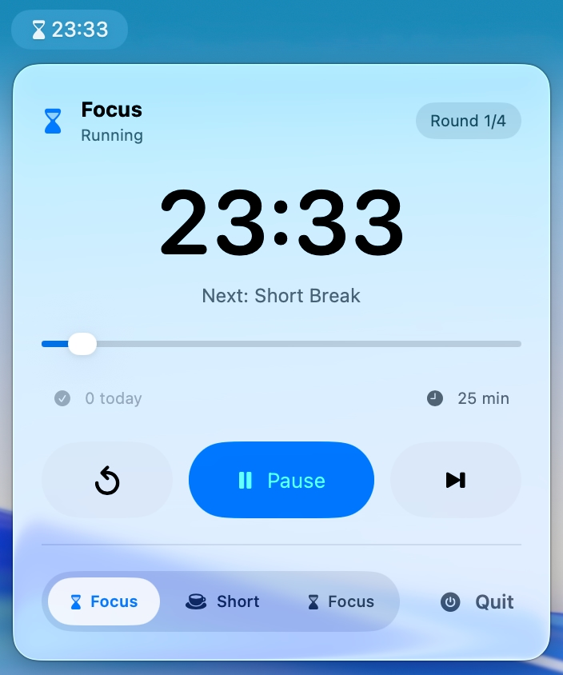

# PomodoroBar

PomodoroBar 是一个轻量的 macOS 菜单栏番茄钟，用 SwiftUI 构建。它不会出现在 Dock 里，可以直接在菜单栏显示倒计时，并在专注或休息结束时发送系统通知。

PomodoroBar is a lightweight macOS menu bar Pomodoro timer built with SwiftUI. It stays out of the Dock, shows the current countdown in the menu bar, and sends a notification when a focus or break session ends.



## 功能 / Features

- 菜单栏倒计时，显示当前阶段图标和剩余时间<br>
  Menu bar countdown with the current phase icon and remaining time.
- 专注、短休息、长休息三个阶段，支持自定义时长<br>
  Focus, short break, and long break phases with customizable durations.
- 可自定义番茄节奏时间线，调整短休息/长休息顺序，最多 6 个番茄<br>
  Custom rhythm timeline with reorderable short/long breaks, capped at 6 pomodoros.
- 主页底部切换器会跟随用户设置的节奏同步，可直接点击阶段跳转<br>
  Home timeline switcher stays in sync with the custom rhythm and supports direct phase switching.
- 支持开始、暂停、重置、跳过和退出，重置会回到当前设置时长起点<br>
  Start, pause, reset, skip, and quit controls; reset returns to the configured duration start.
- 退出后再次打开会恢复之前的阶段和剩余时间<br>
  Restores the previous phase and remaining time after relaunch.
- 自动保存当天完成的专注次数，并支持快速清除当天计数<br>
  Saves the daily completed-focus count locally and supports quick clearing for today's count.
- 倒计时数字滚动动画，时间线滚动和点击回中更顺滑<br>
  Rolling countdown digits with smoother timeline scrolling and recentering.
- 首次冷启动时提示应用已在菜单栏运行<br>
  Shows a first-launch hint so users can find the app in the menu bar.
- 系统通知、提示音、简体中文和英文界面<br>
  System notifications, sounds, and Simplified Chinese / English localization.
- 提供本地 APP 和 DMG 打包脚本<br>
  Local APP and DMG packaging scripts.

## 下载 / Download

请从 [GitHub Releases](https://github.com/Dream-of-July/PomodoroBar/releases) 下载最新版本。

Download the latest build from [GitHub Releases](https://github.com/Dream-of-July/PomodoroBar/releases).

- `PomodoroBar_1.0 Beta 5.dmg`：主版本，适用于 macOS 26.0 或更新版本。<br>
  Main build for macOS 26.0 or later.
- `PomodoroBarLegacy_1.0 Beta 5.dmg`：旧系统版本，适用于 macOS 13.0 或更新版本。<br>
  Legacy build for macOS 13.0 or later.

## 系统要求 / Requirements

- Xcode，需支持 Swift 6<br>
  Xcode with Swift 6 support.
- 主版本：macOS 26.0 或更新版本<br>
  Main target: macOS 26.0 or later.
- 旧系统版本：macOS 13.0 或更新版本<br>
  Legacy target: macOS 13.0 or later.

## 构建 / Build

使用 Xcode 打开 `PomodoroBar.xcodeproj`，然后运行 `PomodoroBar` scheme。

Open `PomodoroBar.xcodeproj` in Xcode and run the `PomodoroBar` scheme.

也可以使用命令行构建：

You can also build from the command line:

```bash
xcodebuild -project PomodoroBar.xcodeproj -scheme PomodoroBar -configuration Release build
```

Legacy 版本：

Legacy build:

```bash
xcodebuild -project PomodoroBar.xcodeproj -scheme PomodoroBarLegacy -configuration Release build
```

## 本地运行 / Local Run

```bash
./script/build_and_run.sh
```

## 打包 / Package

生成本地 APP 并安装到 `/Applications`：

Build a local APP and install it to `/Applications`:

```bash
./script/package_app.sh
```

生成主版本 DMG：

Build the main DMG file:

```bash
./script/package_dmg.sh
```

生成旧系统版本 DMG：

Build the legacy DMG file:

```bash
./script/package_legacy_dmg.sh
```

## 注意 / Notes

PomodoroBar 目前使用本地/开发者签名。如果公开分发未公证版本，用户可能需要在 macOS 的“隐私与安全性”里手动允许打开。

PomodoroBar is currently local/developer signed. If you distribute an unnotarized build publicly, users may need to allow it manually in macOS Privacy & Security.

## 许可证 / License

MIT
